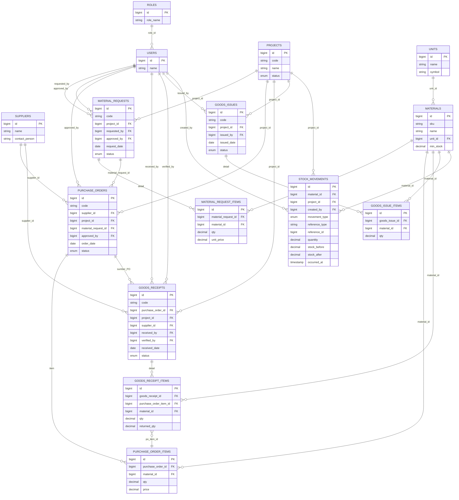

# Catatan Alur Aplikasi Monitoring Proyek

## Struktur Modul Utama
- `routes/web.php` mengarahkan seluruh request dan menempelkan middleware `auth` serta pembatasan `role` untuk dashboard dan modul CRUD.
- `App\Http\Controllers\AuthController` (autentikasi), `DashboardController`, plus controller modular di namespace `Master`, `Procurement`, dan `Supply` menangani logika bisnis.
- Beragam view Blade berada di `resources/views`, dipisahkan per modul sehingga alur UI mengikuti struktur controller.

## 1. Autentikasi dan Penentuan Dashboard
- Halaman awal mengarah ke `/login`; bila sesi sudah aktif pengguna langsung diarahkan ke dashboard sesuai peran (`admin`, `manager`, `operator`).
- Login, registrasi, dan reset password ditangani `AuthController` yang juga memilih rute dashboard memakai helper `dashboardRouteFor`.
- Logout membersihkan sesi dan token, memastikan akses modul lain selalu melewati middleware `auth`.

## 2. Dashboard Berbasis Peran
- `DashboardController` menyiapkan data ringkasan proyek, permintaan material, purchase order, goods receipt, goods issue, dan stok (`buildStockSnapshot`).
- View `resources/views/dashboard/index.blade.php` menampilkan partial berbeda per peran; admin melihat kartu ringkasan, status pipeline, daftar aktivitas terbaru, dan peringatan stok rendah.
- Data dashboard untuk manager/operator terbatas pada partial masing-masing (placeholder untuk pengembangan lanjutan).

## 3. Master Data Proyek dan Material
- Modul Master (`MaterialController`, `SupplierController`, `UnitController`, `ProjectController`) menyediakan CRUD lengkap dengan pencarian, filter, dan paginasi.
- Material terhubung ke satuan (`unit_id`) dan menyimpan `min_stock` sebagai ambang peringatan stok.
- Project memiliki status terdefinisi (`planned`, `ongoing`, `done`, `archived`) yang menjadi dasar agregasi di dashboard.

## 4. Alur Pengadaan Material
1. **Permintaan Material (MR)**
   - Dibuat lewat `MaterialRequestController` dengan item material dan status (`draft`, `submitted`, `approved`, `rejected`).
   - Penyimpanan item dilakukan dalam transaksi; status `approved` otomatis mengisi `approved_by` dan `approved_at`.
2. **Purchase Order (PO)**
   - Controller `PurchaseOrderController` menghubungkan PO ke supplier, proyek, dan opsional ke MR.
   - Status (`draft`, `approved`, `partial`, `received`, `canceled`) mengatur apakah metadata persetujuan diisi.
   - Total nilai dihitung dari subtotal item dalam transaksi.
   - Form pembuatan/ubah PO kini mengisi otomatis daftar item dan proyek ketika memilih permintaan material yang terhubung, sekaligus meminta konfirmasi sebelum mengganti entri manual.
3. **Goods Receipt (GR)**
   - `GoodsReceiptController` mencatat kedatangan material, bisa terkait PO/proyek langsung, serta menyimpan penerima dan verifikator.
   - Validasi memastikan setiap item memiliki kuantitas dan retur tidak melebihi penerimaan.
   - Form GR akan menyelaraskan proyek, pemasok, dan item secara otomatis setelah memilih purchase order, sehingga penerimaan konsisten dengan pesanan.
4. **Goods Issue (GI)**
   - `GoodsIssueController` mendistribusikan stok ke proyek dengan status `draft`, `issued`, atau `returned`.
   - Setiap GI memiliki item material dan dicatat oleh pengguna yang mengeluarkan (`issued_by`).

## 5. Manajemen dan Monitoring Stok
- `Supply\MaterialStockController` menghitung stok terkini dengan menjumlah penerimaan (`GoodsReceiptItem`) dan mengurangi pengeluaran (`GoodsIssueItem`).
- Filter stok mendukung pencarian berdasarkan nama/SKU, satuan, dan status stok (`safe`, `warning`, `critical`).
- Ringkasan stok (total material, akumulasi stok, jumlah per status) tampil di halaman Supply dan juga dipakai di dashboard admin sebagai peringatan awal.

## 6. Relasi Data Kunci
- `MaterialRequest` ↔ `MaterialRequestItem` ↔ `Material` mendeskripsikan kebutuhan material per proyek.
- `PurchaseOrder` ↔ `PurchaseOrderItem` menghubungkan MR (opsional), supplier, dan proyek untuk pengadaan resmi.
- `GoodsReceipt` ↔ `GoodsReceiptItem` dapat mengacu ke item PO agar pelacakan penerimaan sesuai pesanan, termasuk retur (`returned_qty`).
- `GoodsIssue` ↔ `GoodsIssueItem` mengurangi stok dengan referensi proyek penerima.
- `Material` memiliki `unit` dan `min_stock`, yang digunakan untuk memberi label status stok pada modul Supply dan Dashboard.

## 7. Skenario Kerja Utama
1. Operator/Admin melakukan login lalu diarahkan ke dashboard peran.
2. Tim memasukkan master data (Supplier, Unit, Material, Project) sebagai prasyarat.
3. Proyek mengajukan `Material Request` dengan daftar material yang dibutuhkan.
4. Admin memverifikasi MR dan membuat `Purchase Order` kepada supplier terkait.
5. Saat barang tiba, admin/operator membuat `Goods Receipt` untuk mencatat penerimaan fisik; stok bertambah.
6. Stok yang siap dipakai didistribusikan ke proyek melalui `Goods Issue`, mengurangi stok.
7. Dashboard memonitor status pipeline dan peringatan stok; modul Supply menyediakan rincian stok per material.

## 8. Catatan Teknis dan Validasi
- Hampir seluruh operasi simpan menggunakan transaksi database memastikan konsistensi antara header dan item.
- Validasi Laravel memastikan kode unik (SKU, kode proyek, kode dokumen), kuantitas numerik positif, serta keterkaitan data (foreign key `exists`).
- Middleware `role` (mis. `Route::middleware(['auth', 'role:admin'])`) memastikan hanya peran tertentu yang dapat mengakses dashboard atau fitur khusus.
- Soft delete di `Material` menjaga histori tanpa langsung menghapus referensi, sementara controller menangani kasus satuan yang masih dipakai.

## 9. ERD Pengadaan & Stok
Representasi entitas kunci yang menghubungkan permintaan, pembelian, penerimaan, hingga distribusi material:

- Rantai permintaan → pembelian → penerimaan → distribusi semua berpusat pada `materials`, sehingga perhitungan stok memanfaatkan agregasi barang diterima (`goods_receipt_items`) dan barang keluar (`goods_issue_items`).
- `stock_movements` kini menyimpan mutasi granular (masuk, keluar, transfer, adjustment) termasuk stok sebelum/sesudah dan referensi dokumen (`reference_type`, `reference_id`) untuk audit.
- Mutasi stok otomatis direkam melalui `StockMovementService` saat Goods Receipt berstatus `completed` serta Goods Issue berstatus `issued`, sehingga histori stok mengikuti dokumen resmi.

---
Catatan ini merangkum alur end-to-end untuk memudahkan orientasi tim dalam memahami keterkaitan modul Monitoring Proyek.
